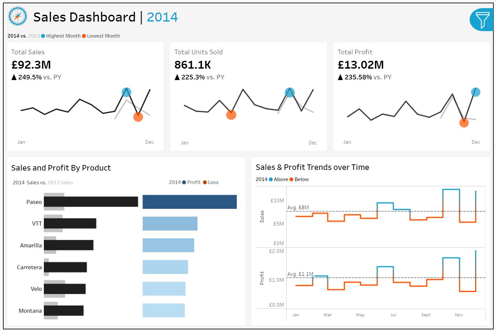
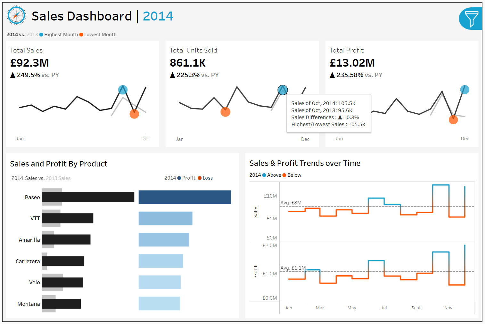
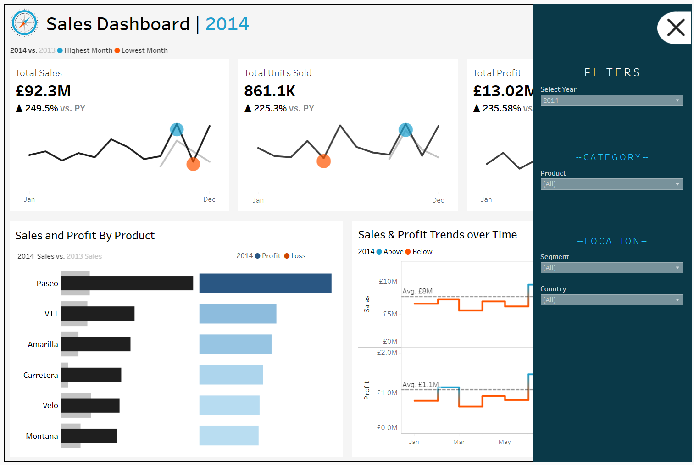
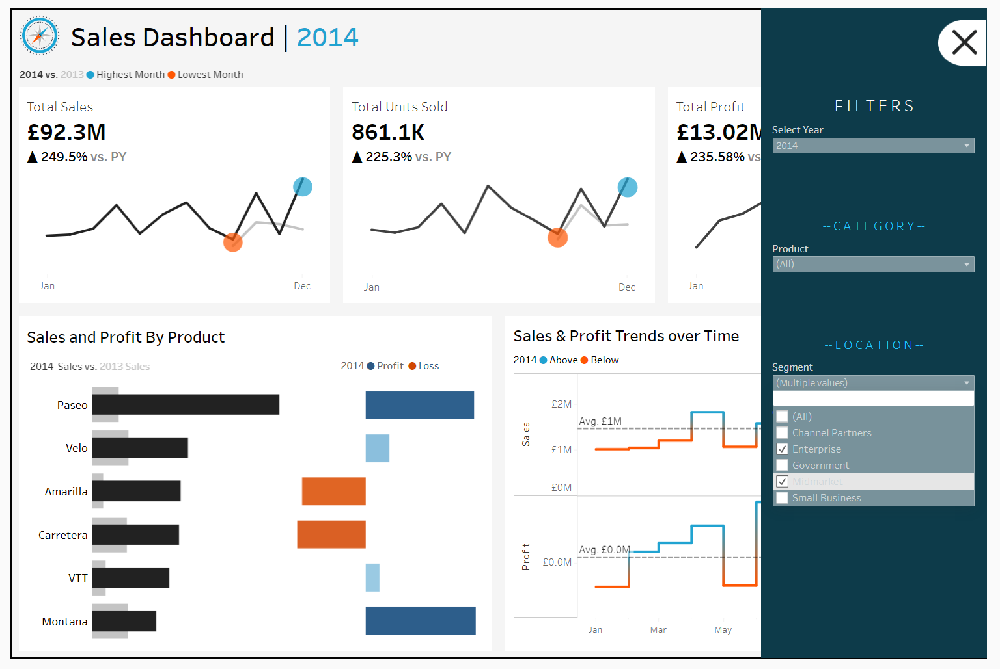
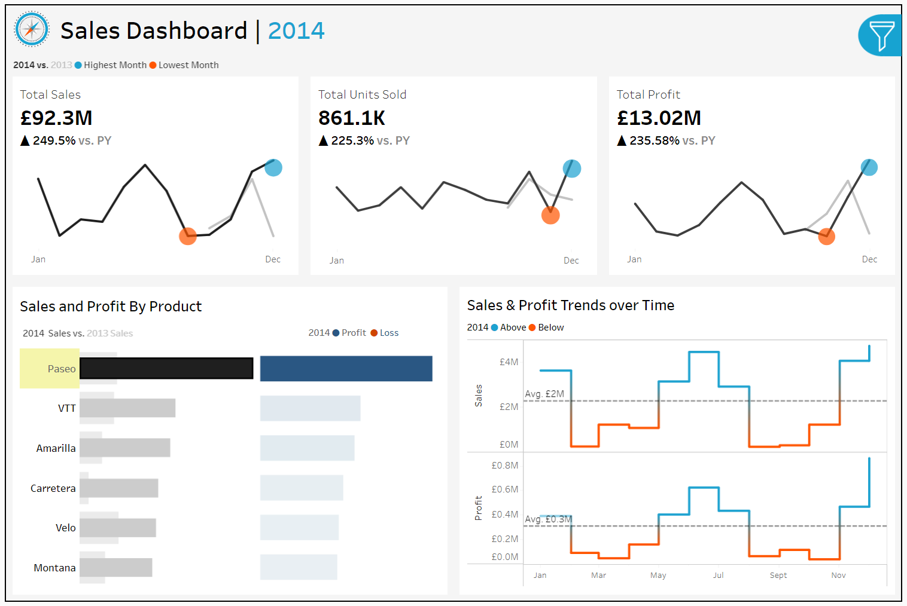

# Data Cleaning and Analysis: SQL & Tableau

## Project Overview
This project demonstrates data cleaning, analysis, and visualization using SQL for preprocessing and Tableau for dashboarding. The data used was sourced from Kaggle and represents sales and financial records for products across various countries and segments. The objective of this project is to clean the dataset using SQL and visualize key insights through an interactive Tableau dashboard.

## Data Source
The data for this project was sourced from Kaggle. You can access the dataset and more details [here](https://www.kaggle.com/datasets/atharvaarya25/financials). The CSV file of the dataset is also available in the Dataset folder within this repository.

## Dataset Description
The dataset contains information about sales, profits, units sold, product segments, and more across multiple regions. Key fields include:
- **Segment**: Product segments such as Consumer, Corporate, and Home Office.
- **Country**: Geographic sales distribution.
- **Product**: Individual product information.
- **Units Sold**: The number of units sold.
- **Profit**: Calculated profit for each sale.
- **Discounts**: Discounts applied to the products.
- **COGS**: Cost of Goods Sold.
- **Date**: Sales date, broken down into year, month, and day, covering the period from **September 2013** to **December 2014**.

---

## Data Cleaning Process
SQL was used extensively to clean the dataset before it was visualized in Tableau. The script used is provided in the repository under the `SQL` folder, It includes:

1. **Removing Special Characters**:
   - Removed `$` sign and `-` from columns where they were present to clean monetary values.
   
2. **Changing Data Types**:
   - Adjusted the data types of relevant columns to accurately represent the underlying data (e.g., converting string fields to numeric).

3. **Removing Thousand Separators**:
   - Commas used as thousand separators in numerical fields were removed for easier analysis.

4. **Handling Missing and Inconsistent Data**:
   - Dealt with missing values and standardized inconsistent entries.

You can find the cleaned dataset in the `SQL` folder of this repository.

## Tableau Dashboard Visualization

The Tableau workbook `.twbx` can be found in the `Tableau` folder. You can open this file using Tableau Desktop to view and interact with the visualizations.

Alternatively, you can explore the full interactive Tableau dashboard by visiting this link:

### [View the Tableau Dashboard](https://mrayane.github.io/Data-Cleaning-Analysis-SQL-Tableau/)

Additionally, you can view some of the sales dashboard’s key features and interactivity in the screenshots below:

### 1. Main Dashboard View:  
This screenshot provides a comprehensive view of the main Tableau dashboard. It showcases key metrics like total sales, profit by country, and segment performance, offering a high-level overview of the dataset’s insights.

  

### 2. Tooltip Functionality:  
When hovering over a specific data point in the dashboard, tooltips appear, providing additional context and details such as profit margins and discount percentages. This feature enhances the interactivity and allows for deeper analysis without overwhelming the dashboard with too much visible data.

  

### 3. Filter Options - Initial View:  
The filter options on the dashboard allow users to select different segments, countries, or time periods to refine the analysis. This screenshot demonstrates how the filters look before any selection is made, allowing users to explore data dynamically based on specific criteria.

  

### 4. Filter Selection in Action:  
This screenshot shows the dashboard after a filter has been applied. The dashboard updates in real-time to reflect the filtered data, highlighting the interactive nature of the dashboard and its ability to adapt to user preferences.

  

### 5. Bar Chart Interaction:  
Clicking on a specific bar in the bar chart drills down into the data, showing more detailed insights about the selected metric. This interactivity helps users focus on particular products and explore patterns at a granular level.

  

These screenshots highlight the interactivity of the dashboard, showing how tooltips, filters, and clicks on chart elements update the entire visualization dynamically.

## Installation and Requirements
To replicate the SQL cleaning process and Tableau dashboard, you'll need the following tools:
- SQL Server Management Studio (SSMS) or another SQL environment.
- Tableau Public or Tableau Desktop for visualization.

## Key Insights
Some of the key analyses and insights visualized in the Tableau dashboard include:

- **Total Sales**: Displays total sales and the percentage difference compared to the previous year.
- **Total Units Sold**: Shows the total units sold and the year-over-year percentage change.
- **Total Profit**: Highlights total profit alongside the percentage difference compared to the previous year.
- **Sales by Product and Year**: Compares sales by product for the selected year, previous year, and includes profit details.
- **Sales & Profit Trends**: Visualizes the trends in sales and profit over time, helping to identify growth patterns.

The dashboard also allows filtering by **year**, **country**, **segment**, and **product** for more detailed analysis. 

## Authors
Rayane Mehires - rayanemehires@gmail.com

Project Link: [GitHub - Data Cleaning and Analysis with SQL & Tableau](https://github.com/MRayane/Data-Cleaning-Analysis-SQL-Tableau)

## Thank You
